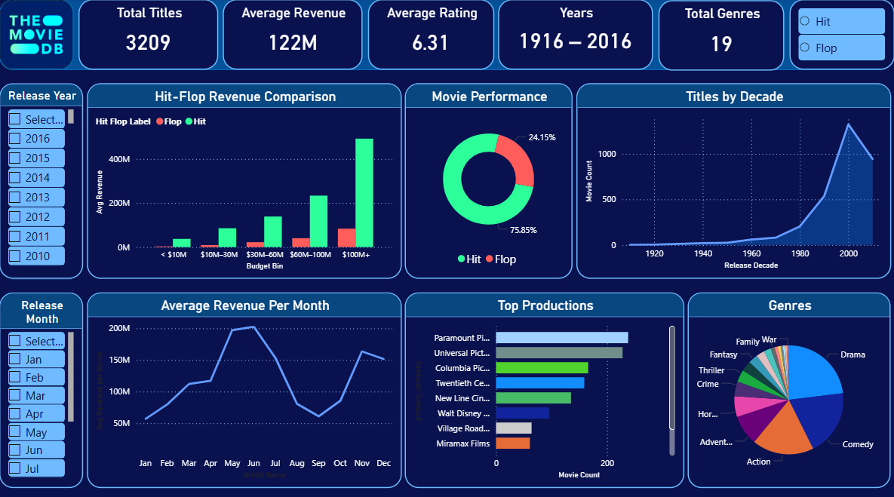
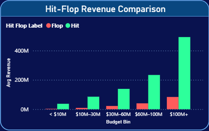
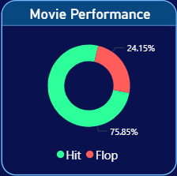
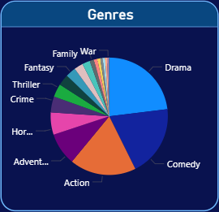
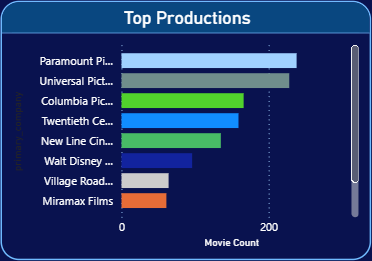

# 🎬 Movie Performance Analytics Dashboard (Power BI)

This repository contains an **end-to-end Power BI analytics project** that explores movie performance using TMDB-style data. The dashboard analyzes trends across **budget, revenue, genre, release period, and audience ratings**, with a strong focus on clarity, interactivity, and business intelligence best practices.

---

## 📊 Project Overview

The objective of this project is to transform raw movie industry data into **actionable insights** through descriptive analytics and interactive visualization. The dashboard enables users to explore movie performance patterns using well-defined KPIs and dynamic slicers.

---

## 📷 Dashboard Preview



---

## 🔍 Key Insights

- Analysis of movies released between **1916 and 2016**
- Comparison of **Hit vs Flop** movies based on revenue
- Seasonal trends in average revenue by release month
- Decade-wise growth in movie releases
- Genre-wise and production company-wise performance
- Audience response analysis using ratings and vote counts

---

## 🎯 Dashboard Features

- KPI cards for high-level summary metrics
- Interactive slicers for Year, Month, and Performance (Hit/Flop)
- Aggregated bar charts for revenue comparison
- Area charts for time-based trend analysis
- Donut charts for performance distribution
- Clean, dark-themed UI optimized for readability

---

## 📊 Key Visuals

### Budget Range vs Average Revenue (Hit vs Flop Comparison)


### Distribution of Hit and Flop Movies



### Genre-wise Distribution of Movies



### Decade-wise Trend in Movie Releases


### Top Production Companies by Movie Count


---

## 🛠️ Tools & Technologies Used

- **Power BI Desktop**
- **DAX** (for KPIs and calculated measures)
- **Power Query** (data cleaning and transformation)
- **Data Modeling & Aggregation Techniques**
- **Exploratory Data Analysis (EDA)**

---

## 📁 Repository Structure

```
Movie-Performance-Analytics-Dashboard/
│
├── powerbi/
│   └── tmdb_dashboard_powerbi.pbix
│
├── report/
│   └── project_report.pdf
│
├── snapshots/
│   ├── Area Chart.png
│   ├── bar_chart.png
│   └── donut_chart.png
    └── genre pie.png
    └── kpi_cards.png
    └── slicer1.png
    └── slicer2.png
    └── slicer3.png
    └── Top productions.png
│
├── data/
│   └── tmdb_data.csv   (optional)
│
└── README.md
```

---

## 🚀 How to Use

1. Download the `.pbix` file from the **/powerbi** folder  
2. Open it using **Power BI Desktop**  
3. Use the slicers to interactively explore the data and insights  

---

## 🔮 Future Enhancements

- Star schema data model implementation  
- Advanced time intelligence (YoY, MoM analysis)  
- Predictive modeling for movie success prediction  
- API-based real-time data integration  
- Deployment using Power BI Service  

---

## 📌 Author

**Alwin Wilson**  
Undergraduate | Data Analytics & Business Intelligence


